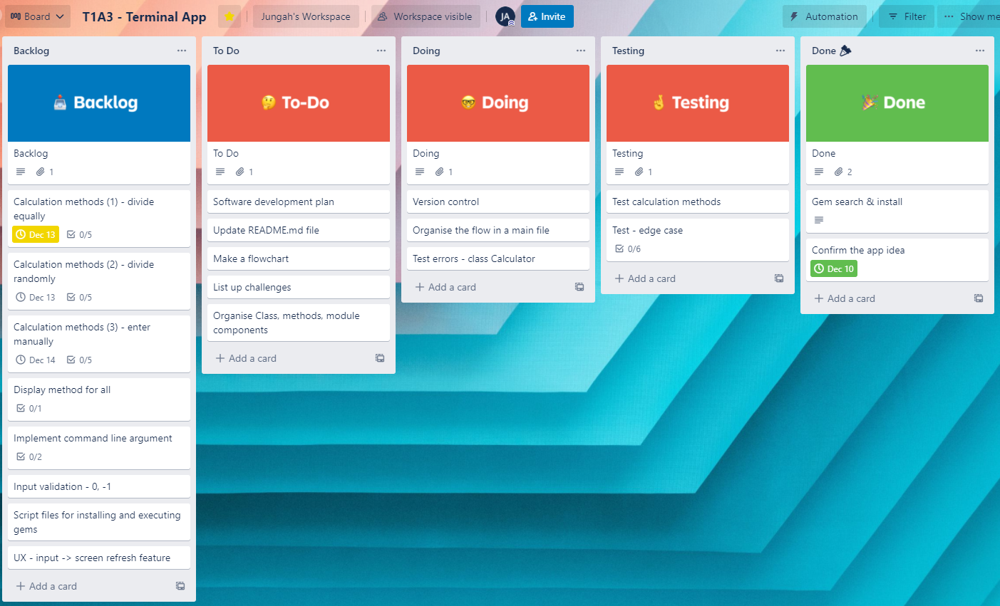

# T1A3 - Terminal Application

## Table of Contents
* [Source Control Repository](https://github.com/aanmeba/t1a3_termianl_app#source-control-repository)
* [Software Development Plan](https://github.com/aanmeba/t1a3_termianl_app#software-development-plan)
* [Features](https://github.com/aanmeba/t1a3_termianl_app#features)
* [User Interaction & Experience](https://github.com/aanmeba/t1a3_termianl_app#user-interaction--experience)
* [Control Flow](https://github.com/aanmeba/t1a3_termianl_app#control-flow)
* [Implementation Plan](https://github.com/aanmeba/t1a3_termianl_app#implementation-plan)
* [Getting Started](https://github.com/aanmeba/t1a3_termianl_app#getting-started)
    * [Requirements](https://github.com/aanmeba/t1a3_termianl_app#requirements)
    * [How To Use](https://github.com/aanmeba/t1a3_termianl_app#how-to-use)
* [Reference](https://github.com/aanmeba/t1a3_termianl_app#reference)

## Source Control Repository
* Here's the 
[repo](https://github.com/aanmeba/t1a3_termianl_app)

## Software Development Plan

The purpose of this terminal application is splitting a bill, an experience that many of us have had, whether it is out at dinner with friends or any other situation with a group expense. However, most applications in the market only provide an option to share the amount equally, but what if there were other options? 

Let's say that the total bill is $99 and you want to split it between three friends. Is the only option to each pay $33? Dividing into $90, $9, and $0 is another potential way to split the check. Or, to avoid needing change, you want to pay $50 and then your friends will share the rest. This application provides users with more options in these three scenarios, one of which is to split the bill evenly, the next one is to share different amounts each, and the last one is for users to choose their own share, and then split the rest. 

Based on these three situations, this program takes valid inputs, calculates them depending on a user's choice, and displays the results in user-friendly way. Apart from that, it handles edge cases to return exact values. When it comes to valid inputs, there are two types of data, names and amounts. This program will only take alphabets for names and positive numbers for amounts. As for the manual option, the amount input can be positive numbers as well as zero (0).

Users simply enter more than two names and the total amount they want to share. Then the program displays options to divide the amount equally, randomly, or manually and the user can choose one of the options using arrow keys on a keyboard.

## Features

* Split Randomly

This divides the input amount randomly. First, it generates an array of random numbers with the size equal to the number of people. If it notices that all the elements in the array are 0, it will trigger ZeroDivisionError in the next step and regenerates another array until the array elements are all valid. 

Then, it divides the total amount by the sum of the random elements in the array and the result value is what I call the multiplier value, which is the amount that the program uses to multiply with the random numbers in order to get the correct total amount. Finally, it returns an array of randomly divided amounts.

* Split Equally

This divides the input amount evenly. In some cases, if the amount can't be equally split up by the number of people, it randomly chooses one person to take the excess. For example, there are 3 people and the total amount is $100. In general, a calculator returns 33.333333333.... but it is not ideal in our real life. With this program, the amounts will be $33.33, $33.33, and $33.34.

This calculation is done to 2 decimal points so the sum of the 100/3 results 99.99. This feature verifies the input amount and the sum of the result. If they are not equal, it picks a random number and adds it to the corresponding person.

* Split Manually

This accepts the user input one by one user to manually share the amount. Since it takes user inputs, handling edge cases is important in order to remove any errors. It validates if the inputs are positive numbers or zero (0), otherwise, if input values are alphabets, symbols, or negative numbers, it raises a warning message and accepts another input from the user.

When only one person is left after entering the amount for every other person, it automatically calculates the rest and allocates it to the last person, then it displays the result on the screen.

## User Interaction & Experience

Typing '-help' or '-info' in the command line when executing this application displays further information on how to use it. Users can enter names and amounts following the instruction and then can select an option using the arrow keys.

## Control flow

* Here's the link to the [flowchart](https://lucid.app/lucidchart/d446112a-d8c4-45cf-81db-cdb4df1e9473/edit?invitationId=inv_b2bd074b-cc3f-4729-aa8a-de055b24321a) (Log in required.)


## Implementation Plan

* Here's the link to the [Trello Board](https://trello.com/b/l7Rq2BOL/t1a3-terminal-app)


## Getting Started

### Requirements

* macOS X with macOS 10.9 or later
* Windows 10
* Ubuntu 12.04 or higher
* Mint 17.1 or higher
* RAM 4gb or higher
* Ruby (preferably, version >= 2.7.0)
* Ruby Gems
    - [tty-prompt](https://github.com/piotrmurach/tty-prompt#25-yesno)
    - [colorize](https://github.com/fazibear/colorize)
    - [artii](https://github.com/miketierney/artii)
    - [rspec](https://github.com/rspec/rspec-metagem) (optional)

### How To Use

1. Make sure Ruby (2.7.0 or higher) is installed in your local. Check your Ruby version with `which ruby` in the command line.

2. Run the bash script file to install the dependencies with `./install_dependencies.sh` in your command line. 
    * If you would like to install them manually, please follow the instruction below.

        ```
        # Install bundler
        gem install bundler
        
        # Install the dependencies specified in the Gemfile
        bundle install
        ```

3. Run the app with `Ruby main.rb`

    * To find more details for each option, please add the `-help` or `-h` in the command line
        ```
        ruby main.rb -help
        ```
    * To know more about this application, please add the `-info` or `-i` in the command line
        ```
        ruby main.rb -info
        ```

## Reference

* [An Intro to Ruby Gems](https://dev.to/milandhar/an-intro-to-ruby-gems-ap8)
* [Bundler Documentation](https://bundler.io/v2.2/man/bundle-install.1.html)
* [Using Bundler to install Ruby gems](https://help.dreamhost.com/hc/en-us/articles/115001070131-Using-Bundler-to-install-Ruby-gems)
